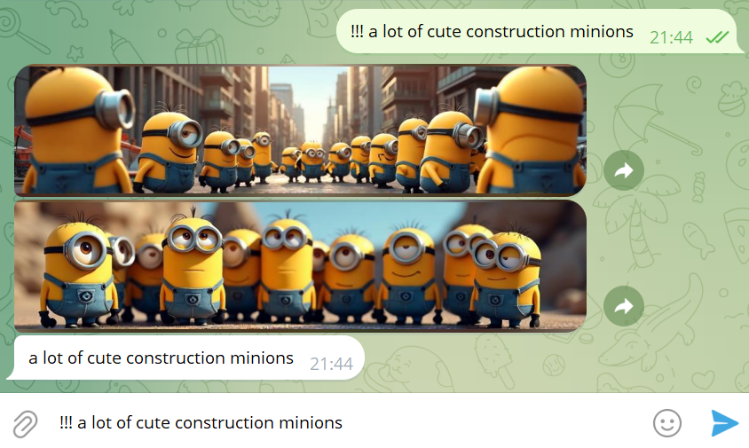

# Small-ComfyUI-Telegram-bot - a messaging bot for the Telegram platform to generate images in ConfyUI on your own PC with a graphics card (FLUX version)


# Prerequisites 

Telegram bot

1. Create a bot through @BotFather (https://habr.com/users/botfather): 
2. Open Telegram and find the bot named BotFather. 
3. Send the /start command and then /newbot to create a new bot.
4. Come up with a name for your bot (for example, "MyTestBot"). 
5. Create a unique username (it must end with "bot", for example, "MyTestBot_bot"). 
6. BotFather will send you an access token — a key that allows you to manage the bot via API. 
7. Save it. You will use it in TG_TOKEN
8. Upd. Default workflow is named `wf-base.json` - feel free to replace it with yours and edit things to your needs


# Installation and Running

#### 1. Clone the repository:
```
git clone https://github.com/sebaxakerhtc/comfyui-telegram-bot.git
cd wf-f1d-telegram-bot
```
#### 2. We are installing all the dependencies required for the Python project, as listed in the requirements.txt file
```
<PATH_TO_YOUR_PYTHON>\python -m pip install -r requirements.txt
```
#### 3. Configuring the example.env file to suit our needs and copy to .env
##### If you want to use LoRA - edit main.py at line 179
##### If running on *Nix replace `\\` with `/`
```
SERVER_ADDRESS = '127.0.0.1:8188' 
TG_TOKEN = XXXXXXXX:XXXXXXXXXXXXXXXXXXXXXXXXXXXXXXX
MODEL='flux1-dev.safetensors'
WEIGHT_DTYPE='default'
T5XXL='t5xxl_fp16.safetensors'
CLIP_L='clip_l.safetensors'
VAE='ae.safetensors'
LORA='Flux\\aidmaHyperrealism-FLUX-v0.3.safetensors'
LORA_STRENGTH=0.8
SAMPLER='euler'
SCHEDULER='normal'
CFG_SCALE=1.0
DENOISING_STRENGTH=1.0
STEPS=30
WIDTH=896
HEIGHT=1152
BATCH_SIZE=2
SEND_PHOTO=True
SEND_PNG=False
PREFIX='!!!'
```
SERVER_ADDRESS - the server address where you are using ConfyUI

TG_TOKEN - your TOKEN of the telegram bot

MODEL - model from <COMFYUI_FOLDER>\ComfyUI\models\unet

T5XXL - <COMFYUI_FOLDER>\ComfyUI\models\clip\clip_l.safetensors

CLIP_L - <COMFYUI_FOLDER>\ComfyUI\models\clip\t5xxl_fp8_e4m3fn.safetensors

VAE - <COMFYUI_FOLDER>\ComfyUI\models\VAE\flux_ae.sft

SAMPLER, SCHEDULER, CFG_SCALE, DENOISING_STRENGTH, STEPS , WIDTH, HEIGHT, BATCH_SIZE - Modify according to your needs or leave it as is.

SEND_PHOTO -  True - if True - the bot will send the jpeg photo

SEND_PNG - True - if True - the bot will send the PNG photo

OR STAY IT AS IS (if you have same)

#### 4. Modify the <COMFYUI_FOLDER>\run_nvidia_gpu.bat if you need, my file is
```
.\python_embeded\python.exe -s ComfyUI\main.py --windows-standalone-build --listen 0.0.0.0 --output-directory C:\exchange\ai\comfy
```

#### 5. Running the ComfyUI on SERVER_ADDRESS
#### 6. Running the bot
```
<PATH_TO_YOUR_PYTHON>\python.exe main.py 
```
# Result and Test

Type in telegram bot:

```
!!! a lot of cute construction minions
```
Waiting...



ENJOY :-)


